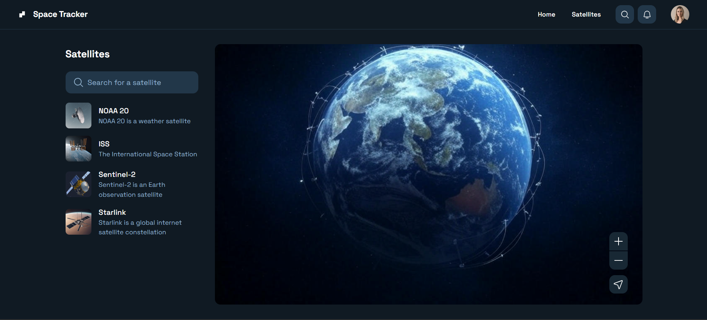
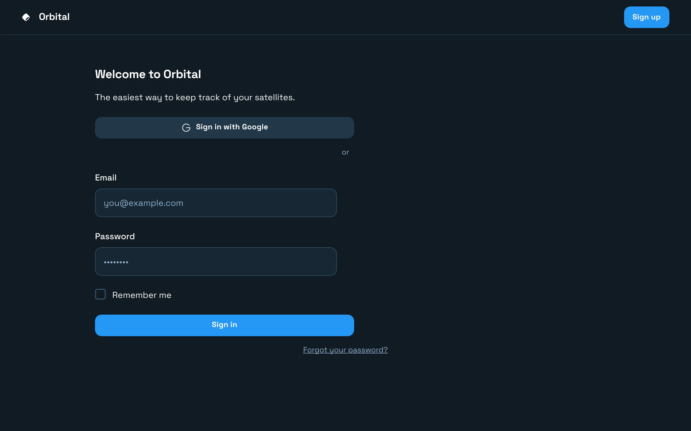
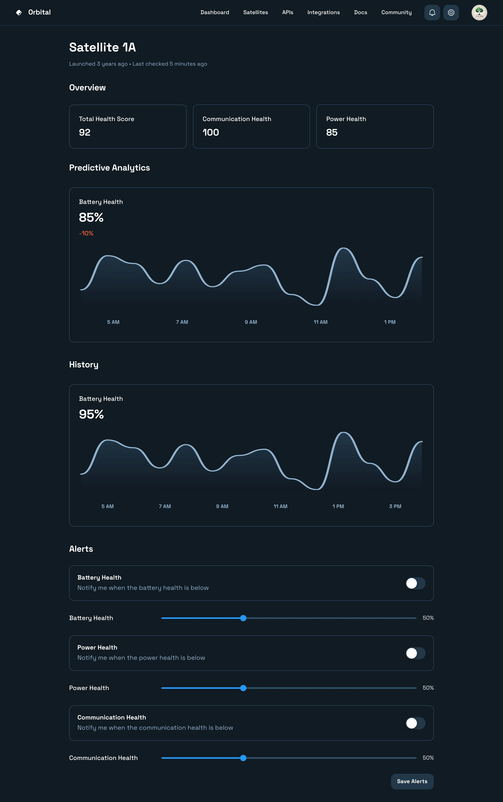
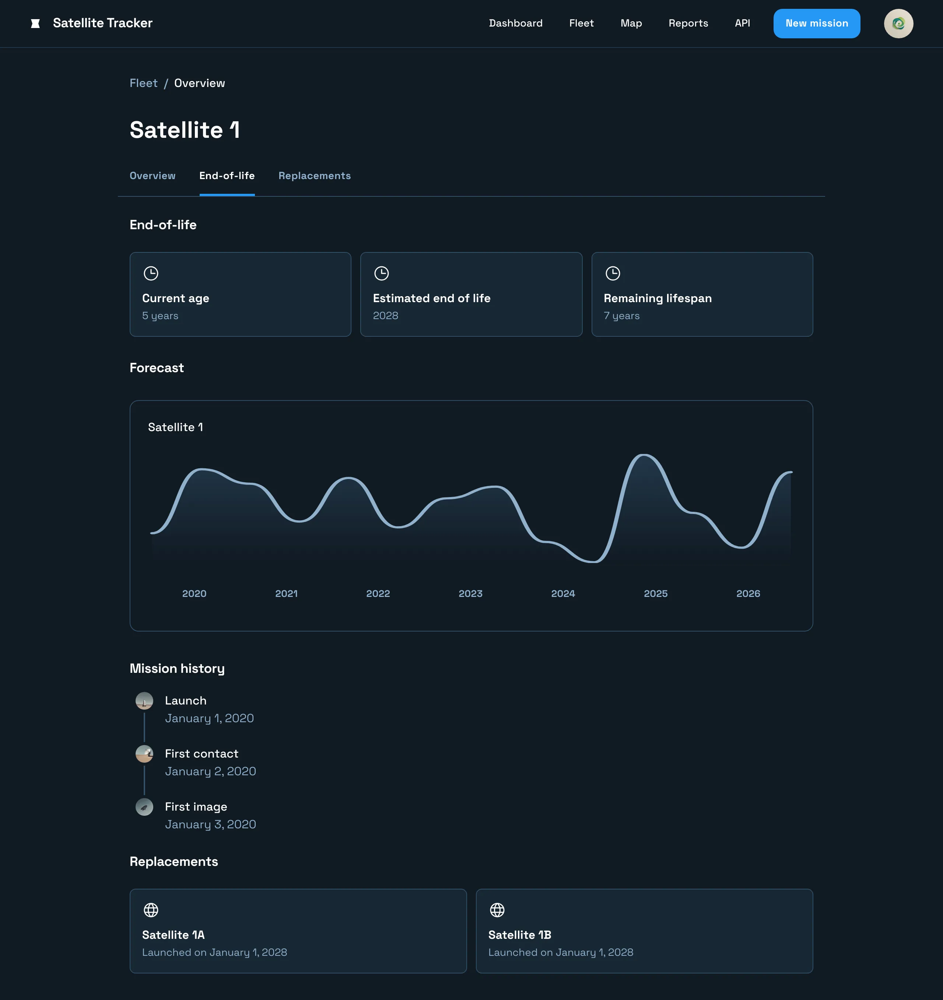
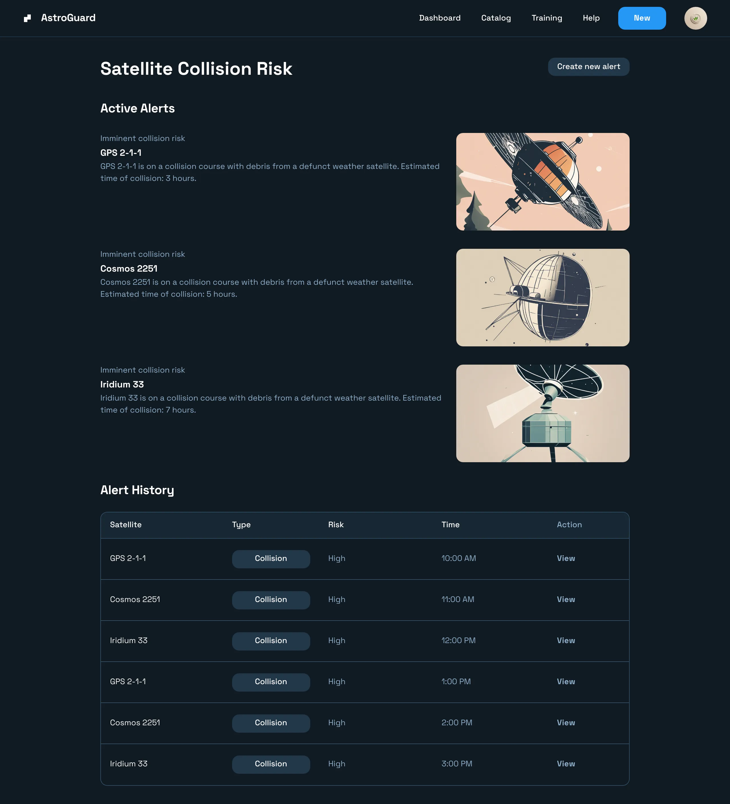
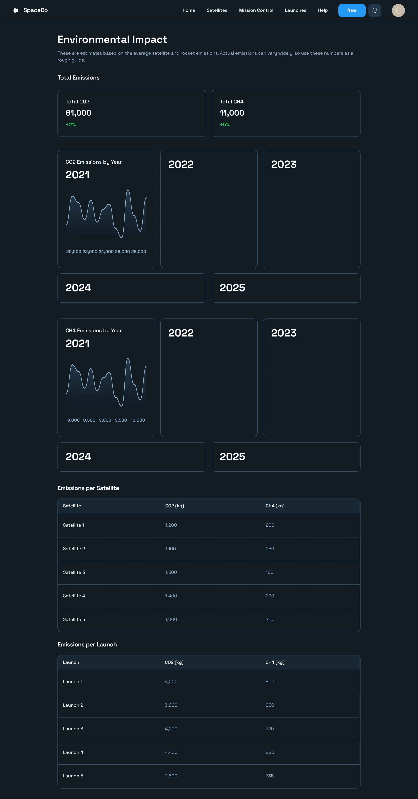

# Satellite Tracker Application

## Project Overview
The Satellite Tracker is an innovative monitoring system designed to provide predictive and real-time insights into the operational status of satellites. This system tracks health status, end of life, pollution levels, and potential collision risks, all powered by advanced AI models.

### Key Features
- **Health Monitoring**: Uses AI to predict potential failures and maintenance needs.
- **End of Life Estimation**: AI-driven predictions on when satellites will cease operations.
- **Pollution Tracking**: Monitors and reports on the pollution emitted by satellites.
- **Collision Detection**: Utilizes real-time data processing to alert potential collisions.

## Interface Snapshots

### Dashboard Overview

*The main dashboard provides a comprehensive overview of all satellites, with the ability to click into detailed views.*

### Satellite Details Page

*Detail view for a selected satellite, showing health status, pollution data, and end of life information.*

### Health Monitoring Service

*This page focuses on the predictive health monitoring of each satellite, displaying various metrics and historical data.*

### End of Life Service

*Provides detailed projections and data about the estimated end of operational life for each satellite.*

### Collision Detection Service

*Displays real-time data and alerts about potential collisions between satellites.*

### Pollution Tracking Service

*Shows detailed information on the pollution levels emitted by satellites, with trends and statistics.*

## Technologies Used

### **Spring Boot**
Used for building the real-time services that handle data processing and alerting mechanisms. Spring Boot supports the rapid development of microservices, facilitating efficient handling of incoming data streams.

### **Django**
Manages the back-end operations including extensive data management from satellite feeds, user interactions, and historical data analytics.

### **Kafka**
Orchestrates the flow of data between services, ensuring that all components of the system receive timely updates. Essential for handling real-time data streams and integrating different services within the architecture.

### **Data Pipelines**
Employs advanced data pipelines to process and analyze telemetry data in real-time, crucial for functions such as collision detection and pollution tracking.

### **AI Models**
Develops and utilizes AI models to predict
