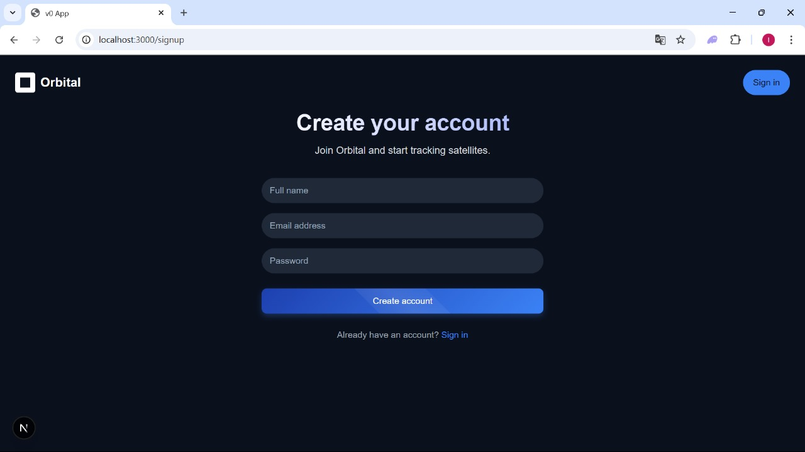

# Satellite Tracker – AI-Powered Space Surveillance System

**Satellite Tracker** is an intelligent satellite monitoring platform that leverages Artificial Intelligence, Kafka, and microservices to provide predictive and real-time insights into satellite operations. It is designed to assist in managing satellite fleets by predicting their **health status**, **end-of-life**, and **potential collision risks**, and by visualizing their operational conditions through an interactive dashboard.

---

## Table of Contents

- [Overview](#overview)
- [Key Features](#key-features)
- [System Architecture](#system-architecture)
- [Microservices Overview](#microservices-overview)
- [UML Diagrams](#uml-diagrams)
  - [Class Diagram](#class-diagram)
  - [Sequence Diagram](#sequence-diagram)
  - [Use Case Diagram](#use-case-diagram)
- [Kafka Data Flow](#kafka-data-flow)
- [MongoDB Collections](#mongodb-collections)
- [UI Mockups](#ui-mockups)
- [Project Folder Structure](#project-folder-structure)
- [Future Improvements](#future-improvements)

---

## Overview

The Satellite Tracker system connects to external APIs (like [N2YO](https://www.n2yo.com)) to collect live satellite telemetry and orbital data. The data undergoes preprocessing before being sent to AI-powered microservices that analyze the information and return predictions.

These predictions are then routed to the backend services that store and serve the results to users via an interactive frontend.

---

## Key Features

### Health Monitoring
- Uses machine learning models to analyze telemetry data such as battery voltage, temperature, and data transmission rate.
- Predicts potential failures and recommends preventive maintenance.

### End of Life Estimation
- Predicts the remaining operational lifespan of satellites based on orbital characteristics and motion analysis.

### Collision Detection
- Continuously monitors distances between orbiting satellites.
- Generates alerts for possible close approaches or collision risks.

---

## System Architecture

### Main Technologies Used:
- **Backend**: Django (Python), Spring Boot (Java)
- **Data Streaming**: Apache Kafka
- **Databases**: MongoDB
- **AI Models**: Python-based ML models (scikit-learn)
- **Frontend**: Nextjs (or any frontend consuming API)

---

## Microservices Overview

| Microservice | Description |
|--------------|-------------|
| `Data Processing Microservice` | Fetches data from N2YO, cleans and prepares it. |
| `Kafka` | Message broker for asynchronously delivering data between services. |
| `Models Microservice` | Contains and executes AI models for health, EOL, and collision prediction. |
| `Prediction Microservice` | Stores and serves predictions for visualization. |
| `User Data Microservice` | Manages user accounts and linked satellites. |
| `Frontend` | Displays visual insights and predictions to end-users. |

---

## 🧬 UML Diagrams

### 📘 Class Diagram
Represents the structure of MongoDB collections used in the project:
- `User` collection with NORAD IDs
- `satellites`, `collision_alerts`, `Eol_collection`, etc.

---

### 📗 Sequence Diagram

Demonstrates the data flow through the microservices(healthStatusFlow):

1. Data is fetched from N2YO
2. Sent to Kafka
3. Received by the Django service for model processing
4. Predictions sent to Spring Boot services
5. Data exposed to frontend 

---

### 📙 Use Case Diagram

Illustrates how different actors (admin, user) interact with the system.

---

## System Realization – Application Mockups

Below are interface mockups that represent the actual user experience of the Satellite Tracker platform. Each screen corresponds to a key functional component in the system, from user onboarding to predictive visualization.

## System Realization – Application Mockups

Below are screenshots of the core interfaces that make up the Satellite Tracker user experience:

---

### Sign In

Secure login page for existing users to access their satellite dashboard.

---

### Sign Up

Registration form allowing users to create a new account and start tracking satellites.

---

### 3D Dashboard

Displays a 3D globe showing real-time positions of satellites and basic operational stats.

---

### Health Status Page

Presents AI-predicted satellite health data, including:
- Battery voltage
- Solar panel temperature
- Attitude control error
- Transmission rate

---

### End-of-Life Page

Shows machine learning-based predictions of the remaining operational lifetime for each tracked satellite.

---

### Collision Alerts Page

Displays warnings for satellites at risk of collision, including:
- Distance to other objects
- Collision time estimate
- Severity level

### Example of kafka running and the workflow of data

In Fetching Data Service in Spring Boot which fetches data from n2yo.com and Send it to Preprocessing service in Django
.png>)

In the main server of django 
-1.png>)

Data sent by Fetching Data to Eol Service
.png>)

---

### Video Demo
https://drive.google.com/drive/folders/1QxA6MUNRYBNzJgKfu4MvqYYhY4_3JfhM?usp=sharing

