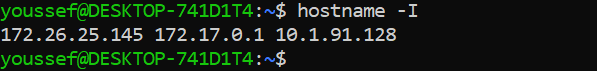

1-vous entrez à votre wsl vous tapez :
    hostname -I
    vous aurez un résultat conatenant deux addresses ips
       
    notez celle à gauche dans mon cas 172.26.25.145

2-Vous allez maintenant ouvrir powershell comme administrateur et exécutez cette commande:
     netsh interface portproxy add v4tov4 listenaddress=0.0.0.0 listenport=32000 connectaddress=172.26.25.145 connectport=32000
     remplacez 172.26.25.145 par l'address ip obtenez dans 1

3- Testez: >curl http://localhost:32000/v2/_catalog en cmd sur windows
    !!! microk8s doit être en ligne sur votre wsl

sudo usermod --add-subuids 100000-165536 jenkins
sudo usermod --add-subgids 100000-165536 jenkins
sudo service jenkins restart

Insufficient permissions to access MicroK8s.
You can either try again with sudo or add the user jenkins to the 'microk8s' group:
sudo usermod -a -G microk8s jenkins
sudo chown -R jenkins ~/.kube

After this, reload the user groups either via a reboot or by running 'newgrp microk8s'.
